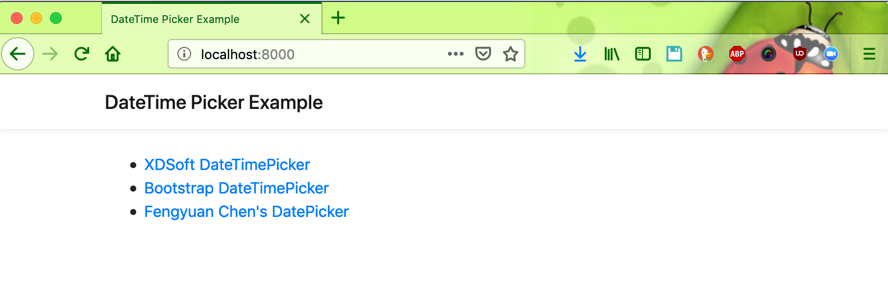
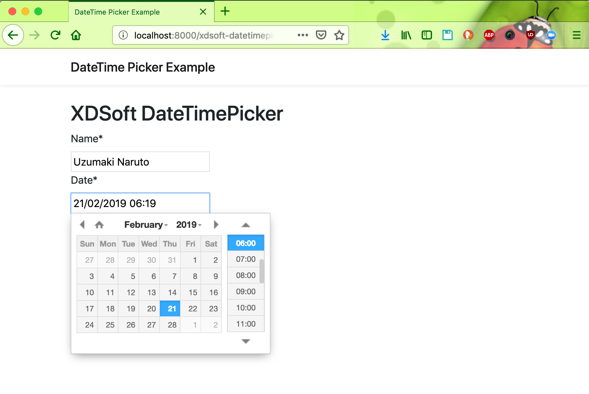
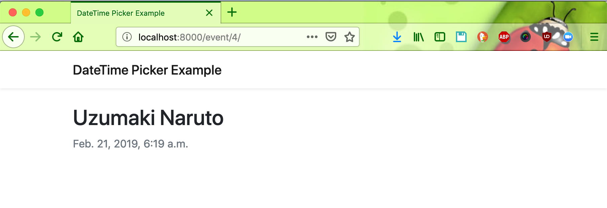
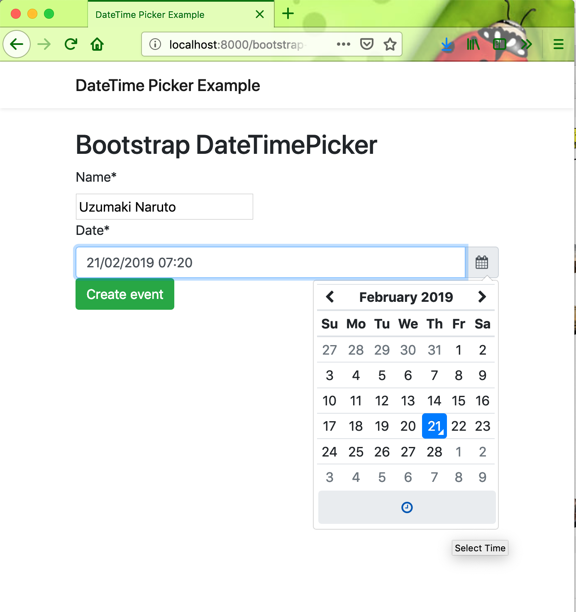
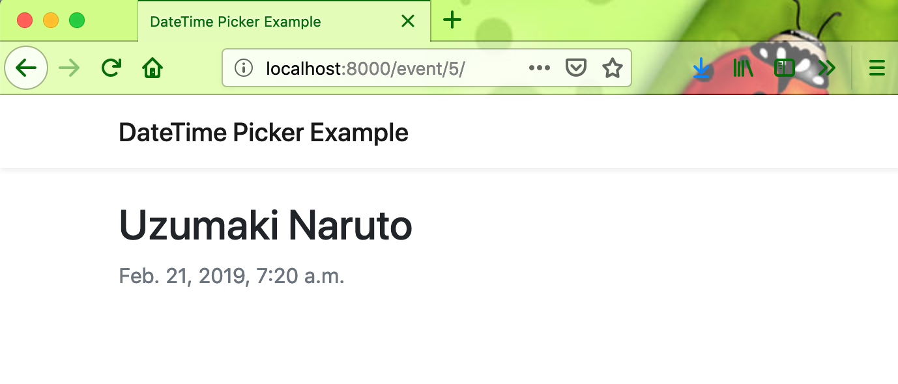
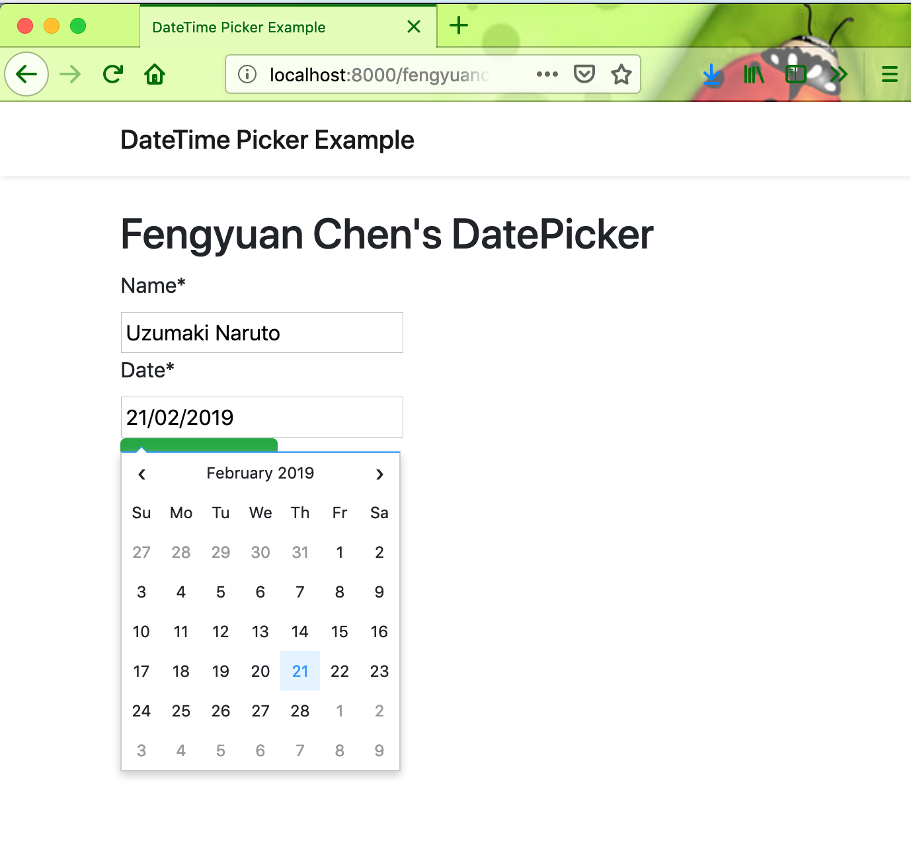

# django-datetimepicker-example

### Running Locally

```
git clone https://github.com/hendisantika/django-datetimepicker-example.git
```
```bash
pip install -r requirements.txt
```
```bash
python manage.py migrate
```
```bash
python manage.py runserver
```

#### Screen shot

##### Home Page



##### Date Picker 1





##### Date Picker 2





##### Date Picker 2



